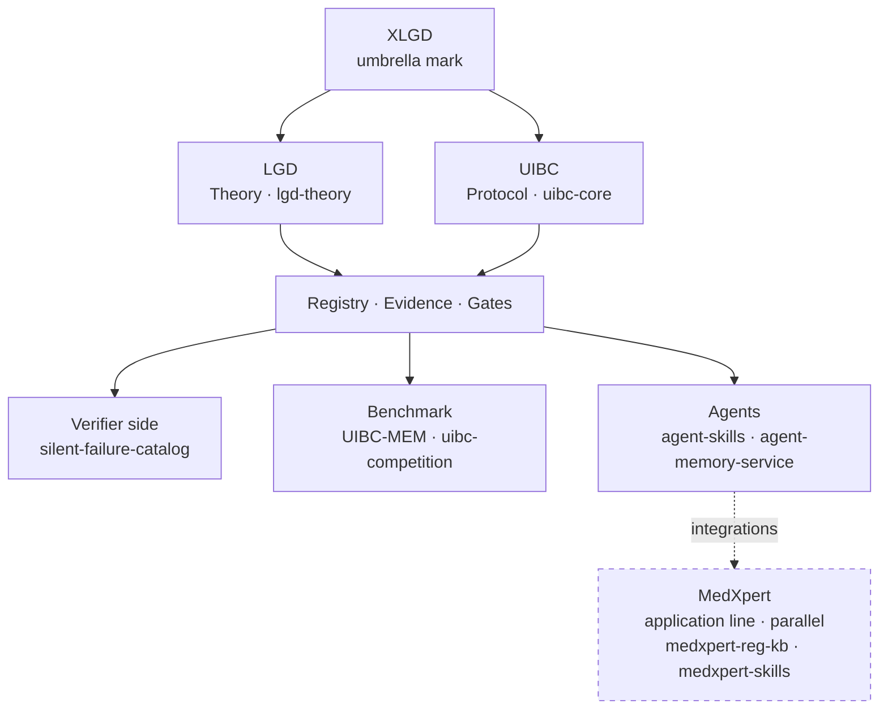

# XLGD — the umbrella mark

> **X 是区别符。** XLGD 是治理线的**伞层标识**，覆盖理论（LGD）与可执行协议（UIBC）。
> MedXpert 是**并行**的应用产品线，不在伞内。
> 所有名称仅为项目标识，**均未申请实体注册、未申请商标注册**；出现仅作来源标识，
> 不构成对法人实体或商标权的任何主张。

## Fixed vocabulary · 固定词汇表

| 术语 | 层 | 含义 |
|---|---|---|
| **XLGD** | 伞（Umbrella） | 治理线伞层标识；X 是区别符，用于标明来源，本身不构成独立概念 |
| **LGD** | 理论（Theory） | *Lifecycle Governance Doctrine* — 凡自治之物：**有籍 · 有证 · 有门禁**，由生到退全程可溯、可证、可问责 |
| **UIBC** | 协议（Protocol） | 可执行协议：registry / evidence / gates，含参考实现与基准 |
| **MedXpert** | 应用（Applications，并行） | 医疗器械合规产品线 |

## Ecosystem map · 生态地图

## Layers · 各层入口

| 层 | 主仓 | 一句话 |
|---|---|---|
| 理论 | [lgd-theory](https://github.com/zhaoxinghua09-cell/lgd-theory) | 全程治理论（LGD）正式文本仓 |
| 协议 | [uibc-core](https://github.com/zhaoxinghua09-cell/uibc-core) | registry / evidence / gates 参考实现（Apache-2.0，`uibc demo` 一键跑通） |
| 验证方 | [silent-failure-catalog](https://github.com/zhaoxinghua09-cell/silent-failure-catalog) | 14 种静默失败模式目录 + 反向对照（ITU FG-TIDA 挑战参考） |
| 基准 | [uibc-competition](https://github.com/zhaoxinghua09-cell/uibc-competition) | UIBC-MEM 记忆迁移竞赛 |
| Agent 集成 | [agent-skills](https://github.com/zhaoxinghua09-cell/agent-skills) | LGD/UIBC 治理技能标准库 |
| 统一入口 | [lgd-hub](https://github.com/zhaoxinghua09-cell/lgd-hub) | 理论 → 技能 → 产品 → 服务 的落地页 |
| 应用（并行） | [medxpert-reg-kb](https://github.com/zhaoxinghua09-cell/medxpert-reg-kb) 等 | MedXpert 医疗器械合规线 |

## 定位

| 项 | 说明 |
|---|---|
| **LGD** | 正式标识 — 理论名 / 概念名 / 徽章 / 域名，一律沿用 |
| **X** | 区别符 — 用于区分署名归属 |

带 `X` 前缀的产出，是同一体系下用于标明来源的版本。X 本身不构成独立概念，不需要展开解释。

## 理论栈

LGD 主张：**凡自治之物 — 有籍（registered）· 有证（evidenced）· 有门禁（gated）** — 由生到退，全程可溯、可证、可问责。

- 主仓：[lgd-theory](https://github.com/zhaoxinghua09-cell/lgd-theory)
- 引用入口：[CITE-ALL](https://github.com/zhaoxinghua09-cell/lgd-theory/blob/main/CITE-ALL.md)
- 机构：SynomosAI Governance Line
- 官网：https://medxpert.cn

## 引用

> XLGD. (2026). *X distinction mark for LGD — Lifecycle Governance Doctrine*. SynomosAI Governance Line.
> https://github.com/zhaoxinghua09-cell/xlgd

## 许可说明 · License Notice

- **权利状态**：本仓库以 **MIT 许可** 许可发布，可依该许可证条款自由使用、修改与再分发。
- **引用建议**：引用时请标注仓库名与原文链接 `https://github.com/zhaoxinghua09-cell/xlgd`
  与权利人「赵兴华 / Steven Zhao·China」。
- **品牌状态限定**：MedXpert、SynomosAI、LGD、UIBC、XLGD 等为相关项目标识，
  **均未申请实体注册、未申请商标注册**；出现仅作来源标识，
  不构成对法人实体或商标权的任何主张。
- **完整条款**：见仓库根目录 [LICENSE](LICENSE)。
- **联系**：zhaoxinghua09@gmail.com ｜ ORCID 0009-0001-0512-1237

---

MIT © 赵兴华 / Steven Zhao·China
